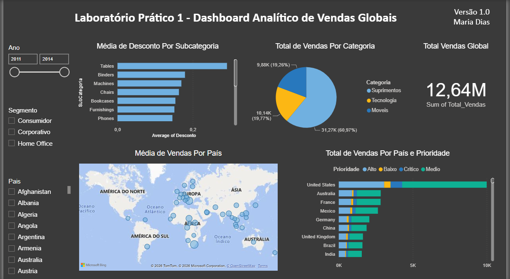

# Lab 01 — Dashboard Analítico de Vendas Globais

---

## 📥 Download do Projeto
* 📊 [Baixar ficheiro do Power BI (.pbix)](./Lab01.pbix)

---

## 📌 Perguntas Respondidas

1. **Qual o valor total vendido?** R$ 12,64M
2. **Quantas vendas foram realizadas por categoria?** Móveis: 31,27K | Tecnologia: 10,14K | Suprimentos: 9,88K
3. **Vendas por país e prioridade de entrega?** EUA lideram com maior volume em todas as prioridades.
4. **Média de desconto por subcategoria?** Tables com maior desconto médio (~0,25).
5. **Países com maior média de valor de venda?** Visualizado no mapa geográfico interativo.

## 🎛️ Filtros disponíveis
Ano (2011–2014) · Segmento · País

## Fonte de dados
Data Science Academy / [data.world](https://data.world)
