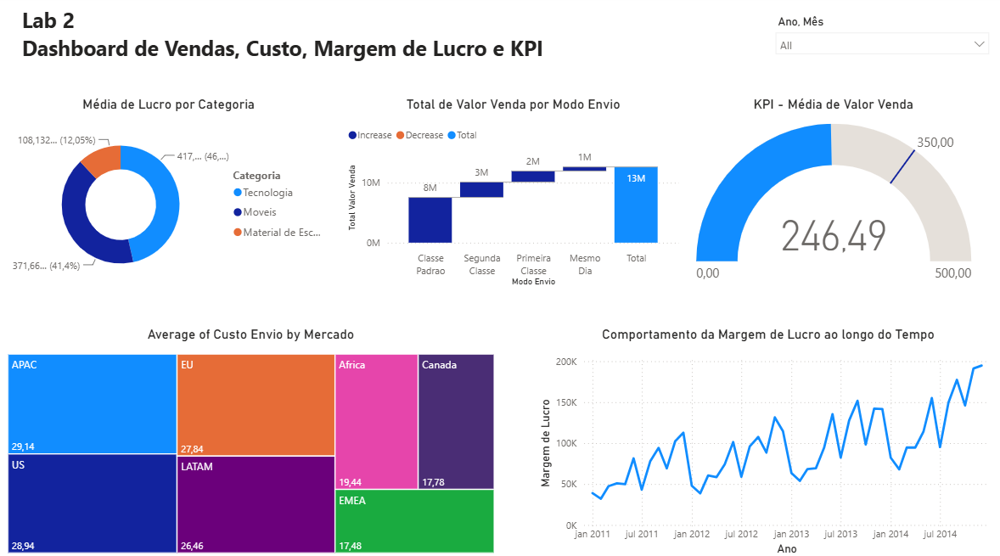

# Lab 02 — Dashboard de Vendas, Custo, Margem de Lucro e KPI

## 📥 Download do Projeto
* 📊 [Baixar ficheiro do Power BI (.pbix)](./Lab02.pbix)

---

---

## 📌 Perguntas Respondidas

1. **Qual foi o total de valor de venda por modo de envio?** 
Classe Padrão: R$ 7,56M | Segunda Classe: R$ 2,57M | Primeira Classe: R$ 1,84M | Mesmo Dia: R$ 677,31K (Total: R$ 12,64M)

2. **Quais mercados tiveram o maior custo médio de envio?** 
APAC lidera (R$ 29,14), seguido de US (R$ 28,94) e EU (R$ 27,84). Os menores custos ficam em EMEA (R$ 17,48) e Canadá (R$ 17,78).

3. **A meta é R$ 350 de venda média mensal. A empresa atingiu a meta em Abril/2014?** 
Não. A média de venda em Abril/2014 foi de R$ 229,62. Abaixo da meta (a média geral do período todo também fica abaixo, em R$ 246,49).

4. **Qual categoria teve maior lucro médio (lucro = valor venda − custo envio)?** 
Tecnologia (R$ 417,86), seguida de Móveis (R$ 371,66) e Material de Escritório (R$ 108,13).

5. **Qual foi o comportamento da margem de lucro ao longo do tempo?** 
A margem se manteve estável durante todo o período (2011–2014), oscilando entre 88% e 91% mês a mês, sem tendência clara de queda ou crescimento.

## 🎛️ Filtros disponíveis
Ano  · Mês

## 🗃️ Estrutura de Dados
Modelo relacional com 4 tabelas ([dados/](./dados)):
* **Vendas:** valor de venda, quantidade, custo de envio. Lucro e Margem de Lucro criadas com expressão e DAX simples.
* **Pedidos:** datas, modo de envio, prioridade
* **Clientes:** segmento, localização, mercado
* **Produtos:** categoria, subcategoria

## Fonte de dados
Data Science Academy / [data.world](https://data.world)
